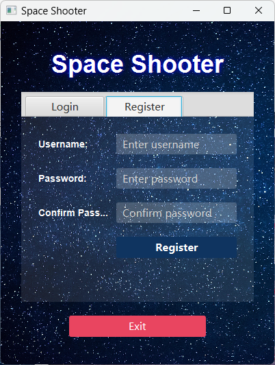
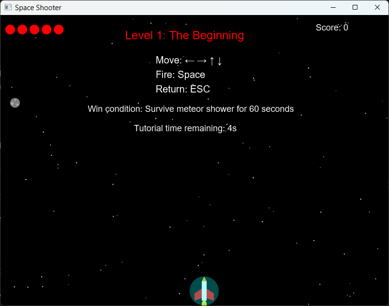
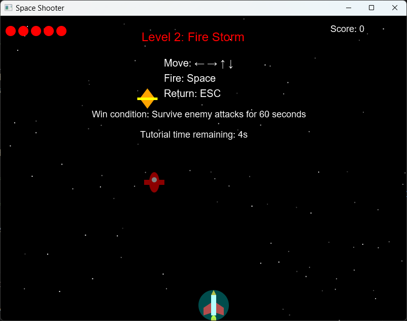
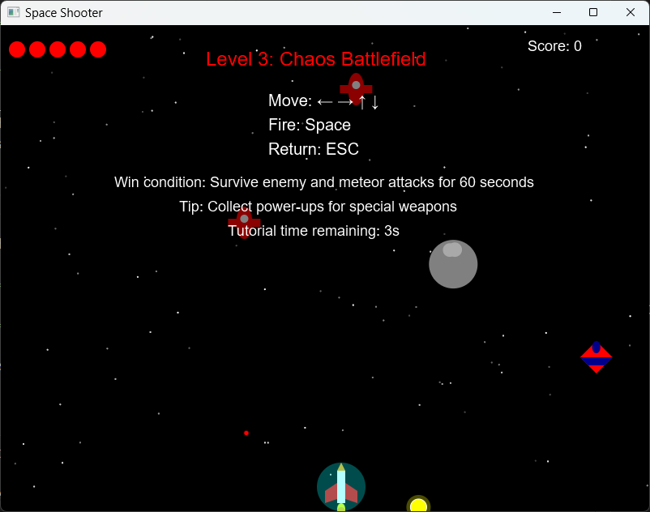
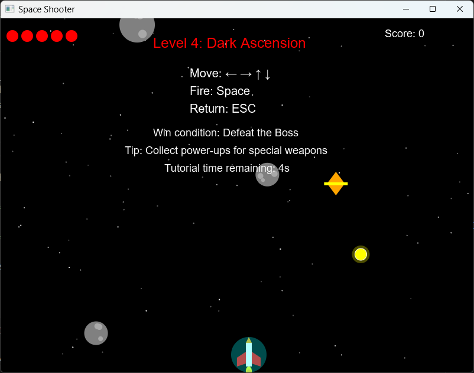
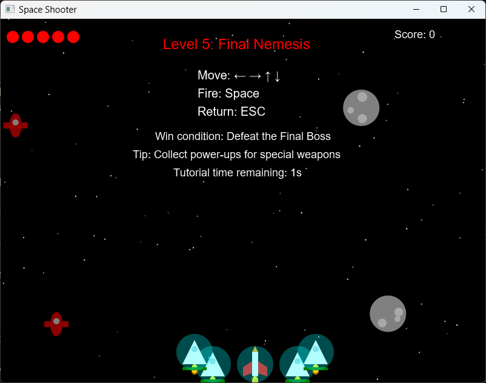

# Space Shooter JavaFX

## 🚀 About the Game

Space Shooter is a 2D vertical scrolling arcade game built using Java and JavaFX. Players pilot a spaceship through hazardous environments, battling waves of enemy ships, dodging meteors, and confronting powerful bosses.

**Key Features:**

* **Account System:** Secure Login and Registration system to track player progress.
* **Multiple Levels:** 5 distinct levels of increasing difficulty.
* **Boss Battles:** Challenging boss fights at the end of critical stages.
* **Dynamic Gameplay:** Includes various enemy types, meteors, and power-ups.
* **Audio/Visuals:** Background music, sound effects, and custom background assets.

## 📸 Gameplay Preview

|                 Login                 |                   Register                   |
| :-----------------------------------: | :------------------------------------------: |
|  |  |

|                Level Selection                |                  Level 1                  |
| :-------------------------------------------: | :----------------------------------------: |
|  |  |
|               **Level 2**               |             **Level 3**             |
|    |  |
|               **Level 4**               |             **Level 5**             |
|    |  |

## 📂 Directory Structure

```text
Space-Shooter-Javafx/
├── src/
│   └── application/        # Source code (Main, Scenes, Entities)
├── image/
│   └── README/		    # Documentation images
│       └── Level1.png
│       └── Level2.png
│       └── Level3.png
│       └── Level4.png
│       └── Level5.png
│       └── Register.png
│       └── Selection.png
├── bin/                    # Compiled Output (Generated)
├── run.bat                 # Windows execution script
├── run.sh                  # Mac/Linux execution script
├── BackgroundMusic.MP3     # Audio asset
├── Figure1.jpg             # Background asset
├── Figure2.jpg             # Background asset
└── README.md               # Documentation
```

## 🛠️ Prerequisites

Before running the project, ensure you have the following installed:

1. **Java Development Kit (JDK):** Version 11 or higher.
2. **JavaFX SDK:** Version 11 or higher (must match your JDK version).
   * Download here: [Gluon JavaFX Downloads](https://gluonhq.com/products/javafx/)

## ⚙️ Configuration

### Setting the Environment Variable (Required)

To keep the project portable, we use an environment variable to locate the JavaFX library.

**For Windows (Command Prompt/PowerShell):**

1. Locate your JavaFX `lib` folder (e.g., `C:\Java\javafx-sdk-21\lib`).
2. Open Command Prompt as Administrator and run:
   **DOS**

   ```
   setx PATH_TO_FX "C:\Path\To\Your\javafx-sdk\lib"
   ```
3. **Restart your terminal** for the change to take effect.

**For macOS/Linux:**
Add the following line to your `~/.bashrc` or `~/.zshrc` file:

**Bash**

```
export PATH_TO_FX="/path/to/your/javafx-sdk/lib"
```

## ▶️ How to Run

### Option 1: Windows (Automatic)

Double-click `run.bat` or run it from the command line:

**DOS**

```
.\run.bat
```

### Option 2: macOS/Linux (Automatic)

1. Make the script executable:
   **Bash**

   ```
   chmod +x run.sh
   ```
2. Run the game:
   **Bash**

   ```
   ./run.sh
   ```

### Option 3: Manual Command

If you prefer running commands manually, ensure the `PATH_TO_FX` variable is set, then run:

**Compilation:**

**Bash**

```
javac --module-path "%PATH_TO_FX%" --add-modules javafx.controls,javafx.media -d bin src/application/*.java
```

**Execution:**

**Bash**

```
java --module-path "%PATH_TO_FX%" --add-modules javafx.controls,javafx.media -cp bin application.Main
```

*(Note: On Mac/Linux, replace `%PATH_TO_FX%` with `$PATH_TO_FX`)*

## 🎮 Controls

* **Movement:** Use **Arrow Keys** to navigate the ship.
* **Attack:** Press **SPACE** to fire projectiles.
* **Interactions:** Use **Mouse** to interact with Menu, Login, and Level Selection buttons.
